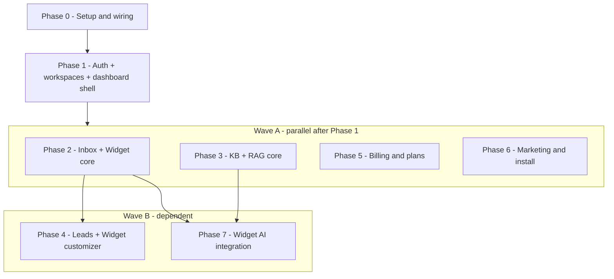

# Zencom — Phased Design Spec

**Status:** Approved  
**Date:** 2026-06-26  
**Stack:** Next.js 16, React 19, Convex, Clerk, Shadcn, Tailwind CSS v4

## Summary

Zencom is a multi-tenant B2B SaaS Intercom/Zendesk-style platform. Clerk Organizations map 1:1 to Convex workspaces. All agent/dashboard backend functions use **org-scoped queries/mutations**. The embeddable chat widget authenticates via a public embed key with anonymous visitor sessions. Monetization uses Clerk **per-seat billing** (Free / Pro / Scale).

Development follows a **wave structure**: sequential foundation (Phase 0–1), parallel Wave A (Phases 2, 3, 5, 6), then dependent Wave B (Phases 4, 7).

---

## Wave Structure



| Phase | Wave | Depends on | Testable outcome |
|-------|------|------------|------------------|
| 0 | Foundation | — | Dev env runs; Shadcn + Convex + Clerk wired |
| 1 | Foundation | 0 | Sign in, create org, dashboard shell + workspace |
| 2 | A | 1 | Embed widget; agent replies in inbox |
| 3 | A | 1 | KB upload; RAG retrieval in dashboard |
| 5 | A | 1 | Per-seat billing; feature gates |
| 6 | A | 1 | Landing, pricing, install docs |
| 4 | B | 2 | Widget customizer; lead pipeline |
| 7 | B | 2, 3 | Widget AI streaming with citations |

---

## Architecture

### Multi-tenancy

| Layer | Mapping |
|-------|---------|
| Clerk Organization | 1:1 Convex `workspaces` row (`clerkOrgId` index) |
| Agent API scope | `orgQuery` / `orgMutation` — JWT `org_id` → workspace |
| Widget API scope | `widgetQuery` / `widgetMutation` — embed key hash → workspace |
| Provisioning | Webhook `organization.created` → workspace + embed key |

Clerk: **Membership required** (B2B-only). Convex: `convex/auth.config.ts` with Clerk JWT issuer.

### Org-scoped queries/mutations (mandatory)

1. Wrapper requires authenticated identity + active `org_id` from Clerk JWT
2. Loads workspace via `by_clerkOrgId` → injects `ctx.workspace`, `ctx.orgId`
3. Handlers never accept `workspaceId` / `orgId` from client args
4. All reads/writes scoped to `ctx.workspace._id`
5. Cross-org access throws `"Unauthorized"`

Client hooks omit tenant ID:

```typescript
useQuery(api.workspaces.getCurrent, {});
// NOT: useQuery(..., { workspaceId })
```

### Widget security

- Hashed embed keys in `workspaces`; plaintext shown once at creation
- Anonymous visitors: `localStorage` session token + `visitors` table
- Widget routes public in `proxy.ts`
- Rate limiting in Phase 5

### Hybrid Convex architecture (chosen)

- Phases 0–2: monolithic domain tables + `convex-helpers` custom functions
- Phase 3+: `@convex-dev/agent` for KB/RAG
- Phase 5: `@convex-dev/ratelimiter` for usage quotas
- Clerk handles billing, orgs, roles

---

## Data Model (evolutionary)

### Phase 1 — `workspaces`

```typescript
workspaces: {
  clerkOrgId: string,
  name: string,
  slug: string,
  embedKeyHash: string,
  widgetSettings: v.object({ /* defaults; expanded Phase 4 */ }),
  createdAt: number,
}.index("by_clerkOrgId", ["clerkOrgId"])
```

### Phase 2 — messaging

`visitors`, `conversations`, `messages` with `workspaceId` indexes.

### Phase 3 — KB

`kbDocuments`, `kbChunks` (vector index), `@convex-dev/agent` in `convex.config.ts`.

### Phase 4 — leads

`leads` table; lifecycle: new → contacted → closed.

### Phase 5 — billing sync

`usageCounters`; workspace fields: `planSlug`, `subscriptionStatus`, `seatCount` (from webhooks, display only).

---

## Phase Deliverables

### Phase 0 — Setup & wiring

Shadcn init, Convex dev linked, env vars, route group scaffold, `convex:dev` script.

### Phase 1 — Auth + workspaces + dashboard shell

`ConvexProviderWithClerk`, `orgQuery`/`orgMutation`, workspaces schema, org webhook, dashboard layout with `OrganizationSwitcher`. **No widget, inbox, KB, or billing UI.**

### Phase 2 — Inbox + widget core

Embed iframe + `embed.js`, real-time messaging, two-pane inbox, filters, assignment, presence, typing.

### Phase 3 — KB + RAG core

Document ingestion, help center CRUD, public `/help/[slug]`, RAG tested from dashboard. **No widget AI.**

### Phase 4 — Leads + widget customizer

Theming, proactive messages, lead capture gate, lead pipeline table, CSV export. **Depends Phase 2.**

### Phase 5 — Billing & plans

Clerk per-seat org billing, webhooks, `has({ plan })` / `has({ feature })`, usage metering.

### Phase 6 — Marketing & install

Landing page, pricing with `<PricingTable for="organization" />`, install docs.

### Phase 7 — Widget AI integration

Streaming RAG in widget, citations, human takeover. **Depends Phase 2 + 3.**

---

## Billing (locked)

Clerk seat-based Organization Plans with **per-seat fee**. Clerk handles seat charging on invite/remove; app does not implement custom seat math.

| Plan | Slug | Base | Included seats | Per-seat after | Seat limit |
|------|------|------|----------------|----------------|------------|
| Free | `org:free` | $0 | 2 | $0 | 2 |
| Pro | `org:pro` | $49/mo | 3 | $12/seat/mo | 20 |
| Scale | `org:scale` | $149/mo | 10 | $8/seat/mo | 100 |

**Convex usage quotas (non-seat):**

| Quota | Free | Pro | Scale |
|-------|------|-----|-------|
| AI messages / mo | 100 | 2,000 | 10,000 |
| KB documents | 5 | 50 | 500 |
| Help articles | 10 | unlimited | unlimited |

Configure via `clerk enable billing --for org` and `clerk config patch`.

---

## App Routes (target)

```
app/
  (marketing)/           # Phase 6
  (auth)/sign-in|sign-up
  (dashboard)/             # Phase 1+
    layout.tsx, settings/, inbox/, kb/, customize/, billing/, leads/
  widget/[embedKey]/       # Phase 2
  help/[slug]/             # Phase 3
  api/webhooks/clerk/      # Phase 1 + 5
public/embed.js            # Phase 2
```

---

## Key Decisions

1. Workspace = Clerk org (`orgId` from JWT)
2. Org-scoped queries/mutations for all agent/dashboard APIs
3. Separate widget function family (embed key auth)
4. Real-time via Convex subscriptions
5. AI: `@convex-dev/agent` — backend Phase 3, widget Phase 7
6. Per-seat billing in Clerk; Convex enforces usage quotas only
7. Shadcn + Tailwind for all dashboard UI

---

## Out of Scope (initial)

- Custom domains for help center
- Enterprise SSO
- Mobile apps
- Email/omnichannel
- Crawl-based KB ingestion

---

## References

- [Convex + Clerk](https://docs.convex.dev/auth/clerk)
- [Clerk Organizations](https://clerk.com/docs/guides/organizations/overview)
- [Clerk seat-based plans](https://clerk.com/docs/guides/billing/seat-based-plans)
- [Convex Agent component](https://www.convex.dev/components/agent)
- Implementation plan: [`docs/superpowers/plans/2026-06-26-phase-0-1-foundation.md`](../plans/2026-06-26-phase-0-1-foundation.md)
